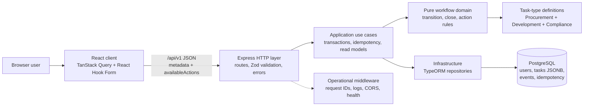

# Extensible Task-Management Platform

Production-oriented task workflow platform implemented from the repository source-of-truth documents in `docs/`.

## Run With Docker

Requires Docker with the Compose plugin. No `npm install` or other host
setup is needed — the build runs `npm ci` inside the images.

```sh
docker compose -f docker-compose.yml -f docker-compose.demo.yml up -d --build
```

Then open:

```text
http://localhost:8080
```

API documentation:

```text
http://localhost:3000/api-docs
http://localhost:3000/openapi.yaml
```

Check status:

```sh
docker compose -f docker-compose.yml -f docker-compose.demo.yml ps --all
curl -fsS http://localhost:8080/health/ready
```

Startup order:

```text
postgres healthy -> migrate completed successfully -> seed completed successfully -> api healthy -> client
```

Reset all containers and database data for this project:

```sh
docker compose -f docker-compose.yml -f docker-compose.demo.yml down -v
```

Ports:

- Browser entry point: `http://localhost:8080`
- Direct API smoke/debugging: `http://localhost:3000`, bound to loopback only
- PostgreSQL: `localhost:5432`, bound to loopback only

## Core Guarantees

- Generic workflow rules are independent from task-specific definitions.
- Procurement, Development, and Compliance are additive task-type definitions.
- Closed state is orthogonal to numeric status.
- Transitions require complete target-status payloads, next assignee, expected version, and idempotency key.
- Task state, audit event, and idempotency outcome commit atomically.
- Retained higher-status data is historical and excluded from `effectiveData`.

## Architecture At A Glance



- `server/src/domain`: pure workflow engine, type registry, task definitions, domain errors.
- `server/src/application`: use-case orchestration, idempotency, read-model mapping, pagination.
- `server/src/infrastructure`: TypeORM entities, PostgreSQL data source, migrations.
- `server/src/http`: Express routes, Zod request validation, error mapping, request/ops middleware.
- `client/src/features/tasks`: generic React task UI driven by `/task-types` and `availableActions`.

## Technology Stack

Backend: Node.js, strict TypeScript, Express, TypeORM, PostgreSQL, Zod, Pino-compatible JSON logging.

Client: React, Vite, strict TypeScript, TanStack Query, React Hook Form.

Tests: Vitest, Supertest-ready server tests, Testing Library, Playwright, real PostgreSQL integration support.

## Project Structure

```text
server/     Express API, domain, application, persistence, migrations, tests
client/     Vite React client, component tests, Playwright specs
docs/       SPEC, OpenAPI contract, architecture, ADRs
scripts/    repository verification helpers
```

## Domain Semantics

Tasks start at status `1`, open, version `1`, and assigned to exactly one seeded user. Forward transitions move exactly one status. Backward transitions may target any lower defined status. Every transition submits a complete payload for the target status and replaces that status's stored payload. Closing is only allowed at final status, keeps the current assignee/status, increments version, and makes the task immutable.

The client separates task browsing filters from task creation. Filters support all users or a specific assignee plus all/open/closed state. Creating a task happens in a New Task modal with an explicit initial assignee, then the filters adjust so the new open task is visible and selected. Open and closed tasks use textual badges plus distinct accessible styling, and task rows/details show a compact task ID derived from the canonical task UUID. Open task details show server-provided available actions before the grouped Current task data panel. Closed task details show a read-only notice and no mutation controls. Current task data and activity are presented with workflow and field labels rather than raw JSON as the primary UI; Activity remains the historical transition source.

## API Contract

The public contract is `docs/api/openapi.yaml`. The API service also serves a
lightweight Swagger UI at `http://localhost:3000/api-docs` and the raw contract
at `http://localhost:3000/openapi.yaml`. Swagger lists the endpoints from the
checked-in contract, including health routes and business routes under
`/api/v1`.

Task browsing uses `GET /api/v1/tasks` with optional `assignedUserId`, `state`, `limit`, and `cursor` query parameters. Omitting `assignedUserId` returns tasks for all users. Task pages include `items`, `nextCursor`, and `totalCount`. `GET /api/v1/users/{userId}/tasks` remains available for compatibility and returns the same page shape.

Errors use:

```json
{
  "error": {
    "code": "VERSION_CONFLICT",
    "message": "The task has changed since it was read.",
    "details": {},
    "requestId": "request-id"
  }
}
```

## Data Model

- `users`: deterministic demo users only.
- `tasks`: current task state, assignee, version, `closed_at`, status-keyed JSONB custom data.
- `task_events`: append-only lifecycle events.
- `idempotency_records`: mutation reservation, fingerprint, replay response, lease, expiry.

Task-list queries use assignee-leading and all-user ordering indexes, including partial indexes for open and closed all-user filters.

## ADR Index

- ADR-001: Express layered architecture.
- ADR-002: code-defined task-type registry.
- ADR-003: closed state orthogonal to status.
- ADR-004: status-keyed JSONB custom data.
- ADR-005: complete target payloads.
- ADR-006: row lock plus expected version.
- ADR-007: idempotent mutations.
- ADR-008: append-only task events.
- ADR-009: server-driven actions.
- ADR-010: co-located validation and definition integrity.
- ADR-011: versioned REST API and stable errors.
- ADR-012: authentication out of scope.
- ADR-013: no in-place status-data edit.
- ADR-014: PostgreSQL, TypeORM, migrations, deterministic seeds.
- ADR-015: production verification gates.
- ADR-016: container runtime topology.

Full records are in `docs/architecture/adr/`.

## Security Considerations

Authentication, authorization, user management, invitations, sessions, tokens, and roles are deliberately out of scope. The API boundary keeps space for a future authenticated principal and authorization policy.

## Known Limitations

- Idempotency record cleanup is operational.
- New generic field kinds require one generic validator and renderer.
- Code-defined workflow changes require deployment.
- No in-place amendment endpoint exists.
- Closed tasks cannot be reopened.

## Adding Another Task Type

1. Add one `TaskTypeDefinition` with ordered contiguous statuses and co-located validators.
2. Register it in `server/src/composition-root.ts`.
3. Use existing field kinds when possible.
4. Add definition/unit fixtures and, if client behavior matters, a generic renderer test.

No workflow engine, persistence schema, controller, route, use-case, or existing definition change should be needed.

## Production Deployment Notes

Run migrations explicitly and serially before starting application processes. Keep secrets outside images and source. Use PostgreSQL with backups and an operational idempotency-expiry cleanup job. In an actual deployment, expose only the reverse proxy or platform ingress publicly; direct API publishing and demo seeding are local conveniences. Do not expose this system to untrusted users without adding an authentication/authorization layer.
