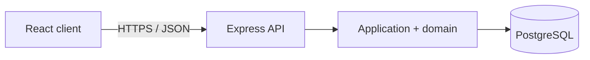
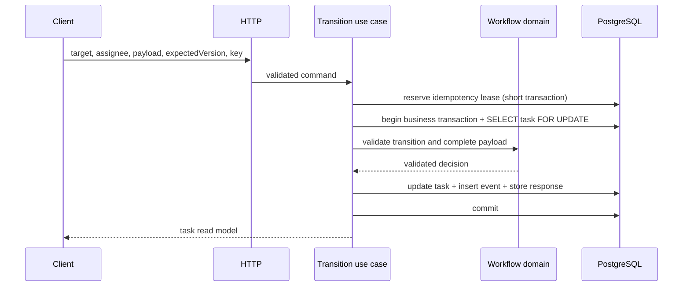

# System Architecture

## 1. Architectural objective

The architecture must make generic workflow enforcement independent of task-type-specific data rules while providing a production-quality HTTP API and React client. The central proof is that a third task type can use the same engine, application use cases, persistence model, endpoints, and generic UI field vocabulary.

## 2. System context



Authentication is deliberately outside scope. In a real deployment, an identity layer would sit before the HTTP application and provide an authenticated principal for authorization.

## 3. Repository shape

Recommended structure:

```text
/
  AGENTS.md
  README.md
  package.json
  server/
    src/
      domain/
        workflow/
        task-types/
        errors/
      application/
        use-cases/
        ports/
      infrastructure/
        database/
        repositories/
        idempotency/
        logging/
      http/
        routes/
        controllers/
        middleware/
        schemas/
        openapi/
      composition-root.ts
      app.ts
      server.ts
    migrations/
    test/
  client/
    src/
      app/
      api/
      features/tasks/
      components/
      test/
    e2e/
  docs/
```

A lightweight workspace is acceptable. Do not add a monorepo framework solely for package orchestration.

## 4. Backend module boundaries

### 4.1 Domain

The domain layer contains no imports from Express, TypeORM, PostgreSQL drivers, React, or logging frameworks.

Responsibilities:

- generic task and workflow concepts;
- task-type definition contract;
- registry and definition validation;
- transition and close decisions;
- complete target-payload validation through definition-supplied validators;
- available-action calculation;
- domain error types.

Representative interfaces:

```ts
type FieldDefinition =
  | {
      kind: "TEXT";
      name: string;
      label: string;
      required: true;
      minLength: number;
    }
  | {
      kind: "FIXED_STRING_ARRAY";
      name: string;
      label: string;
      required: true;
      exactItems: number;
      itemMinLength: number;
    };

interface StatusDefinition {
  status: number;
  label: string;
  fields: readonly FieldDefinition[];
  validateCompletePayload(input: unknown): Record<string, unknown>;
}

interface TaskTypeDefinition {
  key: string;
  label: string;
  initialStatus: 1;
  finalStatus: number;
  statuses: ReadonlyMap<number, StatusDefinition>;
}
```

Field metadata and validators are co-located. Startup checks must detect drift between the serializable field contract and validation behavior.

### 4.2 Application

Application use cases orchestrate domain decisions and infrastructure ports:

- `CreateTask`;
- `TransitionTask`;
- `CloseTask`;
- `GetTask`;
- `ListTasks`;
- `ListAssignedTasks`;
- `ListTaskTypes`;
- `ListTaskEvents`.

The application layer owns transaction boundaries, idempotency orchestration, task locking, repository calls, event creation, and mapping domain entities into read models. It does not contain Procurement/Development branches.

### 4.3 Infrastructure

Infrastructure implements:

- TypeORM entities, migrations, and repositories;
- PostgreSQL transaction and pessimistic-lock behavior;
- idempotency-record persistence;
- task-event persistence;
- structured logging and configuration adapters;
- health dependency checks.

No domain rule may exist only in a database repository. Database constraints provide defense in depth but do not replace domain validation.

### 4.4 HTTP

HTTP responsibilities:

- Express routes and thin controllers;
- request headers, path/query/body validation;
- OpenAPI-compliant DTO mapping;
- centralized error-to-HTTP mapping;
- request IDs, structured request logging, security headers, CORS, and body limits;
- liveness and readiness routes.

Controllers call one application use case and contain no transactions, TypeORM queries, or workflow rules.

### 4.5 Composition root

`composition-root.ts` is the only place that assembles concrete infrastructure, application use cases, controllers, and the task-type registry. Adding a type requires a definition plus explicit registration here. Literal filesystem auto-discovery is intentionally rejected.

## 5. Frontend architecture

The React client treats server data as server state:

- TanStack Query owns queries, mutation state, caching, and invalidation.
- React Hook Form owns form state.
- Generic field components render the server's supported field vocabulary.
- `GET /task-types` drives type selection and creation labels.
- `GET /tasks` drives task browsing for all-user and single-assignee filters.
- A task's `availableActions` drives transition and close controls.
- The task detail renders available actions before the grouped Current task data
  panel for open tasks and renders no mutation affordances for closed tasks.
- Effective task data is rendered with labels from task-type status and field
  metadata in one grouped panel. Retained higher-status data is not shown as
  current task data.
- Task events are rendered as a readable activity list in the server-provided
  order. User IDs are resolved through the users read model when available, and
  unresolved IDs use a neutral fallback.
- The client submits `expectedVersion` and generates an idempotency key for every mutation.
- The idempotency key belongs to one logical submission and is reused only for
  an uncertain retry of the same unchanged payload.
- Query keys include assignee, state, page size, and cursor state so stale filter responses cannot replace the active result.
- Creation is isolated in a modal or drawer with explicit initial assignment; after successful creation the client adjusts filters so the new open task is visible and selected.
- A retry reuses the same idempotency key; a user-initiated new attempt uses a new key.
- The server remains authoritative; disabled or hidden controls are UX affordances, not enforcement.

Suggested feature structure:

```text
features/tasks/
  api/
  components/
    TaskList.tsx
    TaskCard.tsx
    CreateTaskForm.tsx
    TransitionForm.tsx
    DynamicField.tsx
    TaskHistory.tsx
  hooks/
  model/
```

Do not add Redux unless future client-owned global state creates a demonstrated need.

## 6. Request flows

### 6.1 Create task

1. HTTP layer validates `Idempotency-Key` and body.
2. Idempotency service reserves or resolves the key using the canonical request fingerprint.
3. Application validates task type and user.
4. Transaction inserts task at status 1/version 1, `TASK_CREATED` event, and completed idempotency result.
5. Commit.
6. Map task to its read model, including available actions.

### 6.2 Transition task



The user lookup may occur before or after the task lock, but it must be repeated or trusted through a foreign key inside the transaction. Use a consistent lock order to avoid deadlocks.

### 6.3 Close task

The close flow mirrors transition without target data or reassignment. After the task lock, validate expected version, open state, and final status. Update `closedAt` and version, insert `TASK_CLOSED`, complete the idempotency record, and commit.

### 6.4 Idempotent replay

- Same key and fingerprint with a completed record returns the stored response without locking or mutating the task.
- Same key with a different fingerprint fails.
- An identical in-progress key fails with a retryable conflict.
- The stored response is the original response, not a newly rendered current task, so retry semantics are stable.

## 7. Persistence model

### 7.1 `users`

| Column | Notes |
|---|---|
| `id` UUID PK | Deterministic UUIDs for demo seeds |
| `display_name` text | Non-empty |
| timestamps | Creation/update as appropriate |

No user-management endpoints are provided.

### 7.2 `tasks`

| Column | Notes |
|---|---|
| `id` UUID PK | Generated by server |
| `type` text | Immutable task-type key |
| `current_status` integer | Positive |
| `assigned_user_id` UUID FK NOT NULL | Exactly one assignee |
| `custom_data_by_status` JSONB NOT NULL | Object keyed by decimal status string |
| `closed_at` timestamptz nullable | Null means open |
| `version` integer NOT NULL | Starts at 1; increments per transition/close |
| `created_at`, `updated_at` | UTC timestamps |

Indexes:

- `(assigned_user_id, closed_at, updated_at DESC, id DESC)` for assignment lists;
- `(updated_at DESC, id DESC)` for all-user task-list ordering;
- partial `(updated_at DESC, id DESC)` indexes for open and closed all-user state filters;
- `type` only if demonstrated query needs it;
- primary/foreign-key indexes as normal.

Type-specific final-status validity remains an application invariant because the database does not contain task definitions.

### 7.3 `task_events`

| Column | Notes |
|---|---|
| `id` UUID PK | Event identity |
| `task_id` UUID FK | Parent task |
| `event_type` enum/text | Created, status changed, closed |
| `from_status`, `to_status` | Nullable where creation has no source |
| `from_assignee_id`, `to_assignee_id` | Nullable source on creation |
| `payload` JSONB | Complete transition target payload; empty otherwise |
| `task_version` integer | Resulting version |
| `request_id` text | Operational correlation |
| `created_at` timestamptz | UTC ordering timestamp |

Index `(task_id, created_at, id)` supports deterministic cursor pagination. Application code never updates or deletes events.

### 7.4 `idempotency_records`

| Column | Notes |
|---|---|
| `key` text PK/unique | Required request key |
| `request_fingerprint` text | Hash of canonical method, route, and body |
| `status` | `IN_PROGRESS` or `COMPLETED` |
| `response_status` integer nullable | Completed HTTP status |
| `response_body` JSONB nullable | Original response envelope |
| `locked_until` timestamptz nullable | Short renewable execution lease |
| `created_at`, `completed_at`, `expires_at` | Retention lifecycle |

Reservation is committed before the business transaction so concurrent callers can observe `IN_PROGRESS`. The business transaction atomically mutates task state, writes its event, and changes the reserved record to `COMPLETED`. A failed business transaction leaves no task mutation; its reservation is released when possible or may be reclaimed after `locked_until`. Do not log keys. Expiry cleanup is operational, not part of normal request handling.

## 8. Data visibility and read-model mapping

Persistence retains last-submitted payloads for all visited statuses. The task mapper builds:

- `effectiveData` by selecting stored status keys `<= currentStatus`;
- available transition `currentValues` by reading the stored payload for that target, even when the target is currently historical;
- no raw `custom_data_by_status` field in the public API.

The audit endpoint is the authoritative chronological history. Retained higher-status values in the task row are a convenient prefill/read-model source, not a substitute for audit events.

## 9. Validation

Validation occurs in layers:

1. HTTP schemas validate headers, UUIDs, primitive types, pagination, body shape, and unknown properties.
2. Domain definitions validate complete target payloads and normalize strings by trimming.
3. The workflow engine validates status direction, distance, open state, and closure.
4. The application validates expected version and resource existence.
5. PostgreSQL constraints and foreign keys provide defense in depth.

An input that fails structural HTTP validation returns `400`; task-specific payload failure returns `422`; state conflicts return `409`.

## 10. Error handling

Use typed domain/application errors and one centralized Express error middleware. Never infer status codes in controllers. Every error contains a stable code, safe message, optional structured details, and request ID. Unexpected errors are logged with correlation metadata and return a generic `500` response.

## 11. Observability and operations

- Pino-compatible JSON logs.
- Incoming or generated request ID propagated to response and event records.
- Redaction for authorization headers if added later, cookies, payloads, and idempotency keys.
- `/health/live` checks process liveness only.
- `/health/ready` checks database connectivity and migration compatibility.
- Environment configuration validated before server startup.
- SIGTERM/SIGINT stop accepting requests, drain, close HTTP, and close the database pool.
- OpenAPI linting and contract drift checks run in CI.

Metrics and distributed tracing are compatible future additions but are not required by this package.

## 12. Testing strategy

### 12.1 Domain unit tests

Table-test:

- valid sequential forward movement;
- skipped, same-status, and unknown targets;
- every lower backward target;
- closed immutability;
- final-status close rule;
- complete payload, unknown fields, trimming, quote cardinality, and empty strings;
- action calculation;
- startup definition validation;
- the registered Compliance task type as a third workflow proof.

### 12.2 Application/integration tests

Run against real PostgreSQL, preferably isolated with Testcontainers:

- migrations and deterministic seeds;
- create/transition/backward/re-entry/close lifecycles;
- effective versus retained data;
- task-event atomicity and ordering;
- generic and assigned-user task-list filters, `totalCount`, cursor pagination, and index support;
- missing resource and error mapping;
- rollback on event/idempotency failure.

### 12.3 Concurrency and idempotency tests

- two transitions from the same version: one commit maximum;
- transition racing close;
- two close attempts;
- same key/same fingerprint returns original response;
- same key/different fingerprint fails;
- in-progress duplicate behavior;
- delayed duplicate after intervening transitions fails through version/idempotency semantics.

### 12.4 HTTP contract tests

Use Supertest to verify all paths, status codes, headers, schemas, errors, pagination, and idempotency behavior against OpenAPI.

### 12.5 Client tests

- task-type discovery and creation;
- all-user and single-assignee task filtering through the generic list endpoint;
- generic text and fixed-array fields;
- available forward/backward actions;
- prefilled retained values;
- close visibility;
- loading, empty, filtered-empty, validation, conflict, and retry states;
- creation modal focus, cancellation, pending, and post-create filter adjustment behavior;
- open/closed badges and selected-card styling;
- reuse of an idempotency key for transport retry and new key for a new user action.

### 12.6 End-to-end tests

Mocked Playwright tests cover client rendering, metadata-driven forms, filtering,
closed/read-only behavior, and layout without requiring a backend. A separate
full-stack Playwright suite starts the real API and client against a migrated,
seeded PostgreSQL database and drives a Compliance lifecycle through create,
forward movement, backward movement, re-entry, final status, and close.

## 13. Deployment and delivery

- Provide Dockerfiles and a local Compose setup for PostgreSQL plus application services.
- Use multi-stage builds and non-root runtime users.
- Keep secrets out of images and source.
- Run migrations as an explicit deployment step, not automatically on every process startup unless documented and serialized.
- CI must run formatting, lint, strict type-check, OpenAPI validation, tests, migrations against clean PostgreSQL, and production builds.

### 13.1 Container runtime

The repository provides a production-build, production-like local Docker runtime.
It is not a complete production deployment preset: demo seeding and direct API
port exposure are local conveniences.

Runtime topology:

```text
postgres healthy
  -> migrate completed successfully
  -> api healthy
  -> client
```

The base Compose runtime starts PostgreSQL, runs migrations as a one-shot job,
starts the compiled API, and serves the compiled React client through an
unprivileged Nginx container. Nginx is the browser entry point and proxies `/api`
and `/health` to the API without rewriting those paths. Only frontend routes use
SPA fallback to `index.html`; API and health responses must never fall through to
the React application.

Deterministic demo seeding is available through a separate demo Compose override:

```text
postgres healthy
  -> migrate completed successfully
  -> seed completed successfully
  -> api healthy
  -> client
```

Production deployments should provide real secrets, TLS termination, backups,
idempotency cleanup, and an authentication/authorization layer outside these
local Compose files.

## 14. Deliberate exclusions

Do not add architecture solely to anticipate unspecified scale. In particular, no service decomposition, message broker, outbox, event sourcing, workflow DSL, or authentication provider is required. The boundaries above should permit later additions without pretending they are present.

## 15. Resolved ambiguities

There are no unresolved architecture decisions. The binding resolutions are recorded in `docs/SPEC.md` and the ADR directory. If a code-level choice changes an external contract, domain invariant, persistence semantic, or module boundary, create or supersede an ADR and update all affected source-of-truth documents before implementation.
